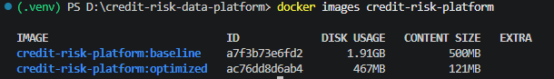

### 1. Docker Image Optimization (Engineering Fundamentals)

To meet operational standards, the project involved building and optimizing a custom Docker Image for the Data Generator application. The optimization strategy focused on minimizing the image footprint and accelerating deployment times.

**Optimization Techniques Applied:**
*   **Base Image Reduction:** Replaced the original `python:3.10` with `python:3.10-slim` to eliminate unnecessary OS-level libraries.
*   **Multi-stage Build:** Implemented `Stage 1` (Builder) to download and compile dependencies into wheels. Only the compiled `.whl` binaries were copied to `Stage 2` (Final Runtime), intentionally leaving behind `build-essential` tools and `apt/pip` caches.
*   **Dependency Isolation:** Created a dedicated `requirements-gen.txt` strictly for the Generator, preventing the accidental inclusion of heavy processing frameworks (e.g., `pyspark`).
*   **Context Filtering:** Configured a strict `.dockerignore` file to prevent local virtual environments (`.venv`) and compiled bytecode (`__pycache__`) from entering the build context.

**Benchmark Results (Content Size):**
*   **Before Optimization (Baseline):** `500MB`
*   **After Optimization (Optimized):** `121MB`
*   **Optimization Efficiency:** Achieved a reduction of **~76%** in actual image size.



---

## 2. How to Reproduce the Benchmark

If you wish to replicate the image size comparison locally, follow these steps from the root directory of the project.

**Step 1: Build the Baseline Image**
This step uses the unoptimized configuration (`python:3.10` full base, single-stage build, no cache clearing).
```bash
docker build -f Dockerfile.non-optimized -t credit-risk-platform:baseline .
```

**Step 2: Build the Optimized Image**
This step uses the production-ready configuration (`python:3.10-slim`, multi-stage build, wheel packaging, and strict `.dockerignore`).
```bash
docker build -f Dockerfile -t credit-risk-platform:optimized .
```

**Step 3: Compare Image Sizes**
Execute the following command to view the actual disk footprint (Content Size) of both images:
```bash
docker images credit-risk-platform
```

**Step 4: Clean Up Build Cache**
To reclaim disk space consumed by intermediate layers and dangling caches generated during the build process, run:
```bash
docker builder prune -f
```