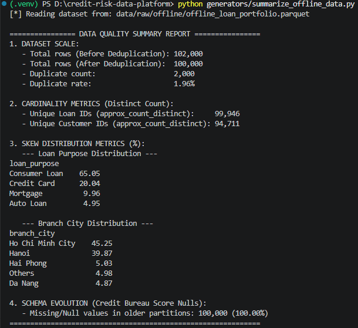

# 📂 Offline Credit Data Generation - Master Index

This document serves as the master navigation index for the **Offline Data Generation** module, providing direct links to the configuration, source codes, generated datasets, and execution evidence.

---

## 📑 Table of Contents & File Links

### 1. Configuration & Environment
* ⚙️ **Generator Configuration (YAML):** [`../configs/offline_config.yaml`](../configs/offline_config.yaml)
* 📦 **Dependencies Requirements:** [`../requirements-gen.txt`](../requirements-gen.txt)

---

### 2. Source Code Implementation
* 🐍 **Data Generator Script:** [`../generators/offline_data_gen.py`](../generators/offline_data_gen.py)
  * *Description:* Generates 100,000+ baseline credit records, injects statistical skewness, simulates schema evolution, and introduces ingestion duplicates.
* 🐍 **Data Quality Summary Utility:** [`../generators/summarize_offline_data.py`](../generators/summarize_offline_data.py)
  * *Description:* Inspects and validates data quality metrics including cardinality (`approx_count_distinct`), duplication rates, and schema drift nulls.

---

### 3. Generated Dataset Output
* 📊 **Parquet Data File:** [`../data/raw/offline/offline_loan_portfolio.parquet`](../data/raw/offline/offline_loan_portfolio.parquet)

---

### 4. Data Quality Validation & Metrics Evidence

Terminal execution output verifying data quality anomaly injections:



#### Summary of Achieved Metrics:
* **Duplicate Rate:** ~2.0% pre-cleaning (simulating upstream storage overlap).
* **Cardinality:** High distinct count verified on `loan_id` and `customer_id`.
* **Skew Distribution:** Proportions aligned with configured YAML probabilities.
* **Schema Evolution:** Partitions older than 180 days correctly return `NULL` for `credit_bureau_score`.

---

## 🚀 Quick Start Guide

```bash
# 1. Activate virtual environment and install dependencies
.venv\Scripts\Activate  # On Windows PowerShell
pip install -r ../requirements.txt

# 2. Run the synthetic data generator
python ../generators/offline_data_gen.py

# 3. Run the data quality inspection utility
python ../generators/summarize_offline_data.py