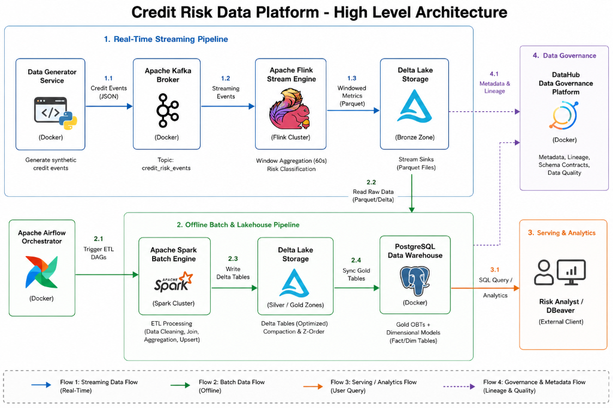

# Credit Risk Data Platform

[](#2-high-level-system-deployment-diagram)
[](#51-online-streaming-pipeline)
[](#52-offline-batch--delta-lakehouse-architecture)
[](#55-data-governance-lineage--quality-contracts)

## Table of Contents
1. [Business Domain & Platform Objectives](#1-business-domain--platform-objectives)
2. [High-Level System Deployment Diagram](#2-high-level-system-deployment-diagram)
3. [Repository Structure](#3-repository-structure)
4. [Quick Start: Running Locally](#4-quick-start-running-locally)
5. [Detailed Documentation Index](#5-detailed-documentation-index)

---

## 1. Business Domain & Platform Objectives
The core business domain of this platform is **Credit Risk Management & Analytics** in modern financial institutions.

In banking and quantitative risk frameworks (e.g., Basel II/III), accurately monitoring credit transactions and calculating risk metrics — such as **Probability of Default (PD)**, **Loss Given Default (LGD)**, and **Exposure at Default (EAD)** — requires both low-latency real-time detection and high-throughput batch analytics.

This enterprise data platform implements a hybrid Lambda/Kappa-inspired architecture:
- **Real-Time Streaming:** Captures credit transaction events via **Kafka** and processes 60-second window aggregations with risk classification (`HIGH`, `MEDIUM`, `LOW`) using **PyFlink**.
- **Offline Medallion Lakehouse:** Ingests raw data into a multi-zone **Delta Lake** storage (Bronze, Silver, Gold) orchestrated by **Apache Airflow** and powered by **PySpark** with Compaction and Z-Order optimization.
- **Data Warehouse Serving:** Synchronizes Gold zone One Big Tables (OBT) and Dimensional models into **PostgreSQL** for business intelligence and quantitative analysis (DBeaver).
- **Data Governance:** Automated end-to-end data lineage, schema contracts, and Great Expectations quality metrics via **Acryl DataHub**.

---

## 2. High-Level System Deployment Diagram

Below is the high-level system deployment architecture illustrating the 4 core color-coded data processing flows:



```mermaid
graph TD
    classDef streamUnit fill:#FFFFFF,stroke:#1D4ED8,stroke-width:2px,color:#0F172A;
    classDef batchUnit fill:#FFFFFF,stroke:#15803D,stroke-width:2px,color:#0F172A;
    classDef servingUnit fill:#FFFFFF,stroke:#C2410C,stroke-width:2px,color:#0F172A;
    classDef govUnit fill:#FFFFFF,stroke:#7E22CE,stroke-width:2px,color:#0F172A;

    subgraph RealTimeStreaming ["1. Real-Time Streaming Pipeline"]
        DataGen["<b>Data Generator Service</b><br/><i>(Docker)</i><br/><br/><small>Generate synthetic credit events</small>"]:::streamUnit
        Kafka["<b>Apache Kafka Broker</b><br/><i>(Docker)</i><br/><br/><small>Topic: credit_risk_events</small>"]:::streamUnit
        FlinkEngine["<b>Apache Flink Stream Engine</b><br/><i>(Flink Cluster)</i><br/><br/><small>Window Aggregation (60s)<br/>Risk Classification</small>"]:::streamUnit
        DeltaBronze["<b>Delta Lake Storage</b><br/><i>(Bronze Zone)</i><br/><br/><small>Stream Sinks (Parquet Files)</small>"]:::streamUnit
    end

    subgraph OfflineBatch ["2. Offline Batch & Lakehouse Pipeline"]
        Airflow["<b>Apache Airflow Orchestrator</b><br/><i>(Docker)</i>"]:::batchUnit
        SparkEngine["<b>Apache Spark Batch Engine</b><br/><i>(Spark Cluster)</i><br/><br/><small>ETL Processing (Data Cleaning, Join, Aggregation, Upsert)</small>"]:::batchUnit
        DeltaGold["<b>Delta Lake Storage</b><br/><i>(Silver / Gold Zones)</i><br/><br/><small>Delta Tables (Optimized)<br/>Compaction & Z-Order</small>"]:::batchUnit
        PostgresDW["<b>PostgreSQL Data Warehouse</b><br/><i>(Docker)</i><br/><br/><small>Gold OBTs + Dimensional Models (Fact/Dim Tables)</small>"]:::batchUnit
    end

    subgraph ServingAnalytics ["3. Serving & Analytics"]
        Analyst["<b>Risk Analyst / DBeaver</b><br/><i>(External Client)</i>"]:::servingUnit
    end

    subgraph DataGovernance ["4. Data Governance"]
        DataHub["<b>DataHub Data Governance Platform</b><br/><i>(Docker)</i><br/><br/><small>Metadata, Lineage, Schema Contracts, Data Quality</small>"]:::govUnit
    end

    %% -------------------------------------------------------------------------
    %% FLOW 1: STREAMING DATA FLOW (Real-Time) - Blue Lines
    %% -------------------------------------------------------------------------
    DataGen -->|1.1 Credit Events (JSON)| Kafka
    Kafka -->|1.2 Streaming Events| FlinkEngine
    FlinkEngine -->|1.3 Windowed Metrics (Parquet)| DeltaBronze

    %% -------------------------------------------------------------------------
    %% FLOW 2: BATCH DATA FLOW (Offline) - Green Lines
    %% -------------------------------------------------------------------------
    Airflow -->|2.1 Trigger ETL DAGs| SparkEngine
    DeltaBronze -->|2.2 Read Raw Data (Parquet/Delta)| SparkEngine
    SparkEngine -->|2.3 Write Delta Tables| DeltaGold
    DeltaGold -->|2.4 Sync Gold Tables| PostgresDW

    %% -------------------------------------------------------------------------
    %% FLOW 3: SERVING / ANALYTICS FLOW (User Query) - Orange Line
    %% -------------------------------------------------------------------------
    PostgresDW -->|3.1 SQL Query / Analytics| Analyst

    %% -------------------------------------------------------------------------
    %% FLOW 4: GOVERNANCE & METADATA FLOW (Lineage & Quality) - Dashed Purple Lines
    %% -------------------------------------------------------------------------
    DeltaBronze -.-|4.1 Metadata & Lineage| DataHub
    DeltaGold -.-|4.1 Metadata & Lineage| DataHub
    PostgresDW -.-|4.1 Metadata & Lineage| DataHub
```

### Architecture Principles & Rubric Compliance
1. **Deployable Units Only:** Every box represents an independently deployable container, cluster service, or external UI (`Data Generator Service (Docker)`, `Apache Kafka Broker (Docker)`, `Apache Airflow Orchestrator (Docker)`, `PostgreSQL Data Warehouse (Docker)`, `DataHub Data Governance Platform (Docker)`, etc.). Embedded libraries/SDKs (Feast SDK, Pydantic, Great Expectations) execute inside the container processes and are omitted as separate boxes.
2. **Data Flow & Arrow Directions:** Arrows strictly follow data transmission direction with explicit payload labels on arrow badges (`1.1 Credit Events (JSON)`, `1.2 Streaming Events`, `2.2 Read Raw Data (Parquet/Delta)`, `3.1 SQL Query / Analytics`, `4.1 Metadata & Lineage`).
3. **Numbered Multi-Flow Lineage:** Distinct color-coded flows with step numbers demarcate platform operations:
   - **Flow 1: Streaming Data Flow (Real-Time — Blue Steps 1.1 to 1.3):** Real-time synthetic event generation, Kafka topic streaming, PyFlink 60s window aggregation, and Bronze zone Parquet streaming sinks.
   - **Flow 2: Batch Data Flow (Offline — Green Steps 2.1 to 2.4):** Airflow-triggered PySpark batch ETL processing, reading raw Bronze Parquet files, writing Silver & Gold Delta Lake tables with Compaction and Z-Order clustering, and syncing Gold tables to PostgreSQL DW.
   - **Flow 3: Serving / Analytics Flow (User Query — Orange Step 3.1):** End-user Risk Analysts performing SQL analytical queries on Gold 360 Risk tables via DBeaver.
   - **Flow 4: Governance & Metadata Flow (Lineage & Quality — Dashed Purple Step 4.1):** Automated emission of data lineage, schema contracts, and data quality execution metadata across Lakehouse zones to DataHub.
4. **Solid vs Dashed Lines:** Primary data processing paths use solid lines (Flows 1, 2, 3); dashed purple lines are reserved for metadata, lineage, and governance synchronization (Flow 4).

---

## 3. Repository Structure

```text
credit-risk-data-platform/
│
├── dags/                           # Airflow DAG definitions (DP1, DP2, DP3 orchestrations)
│
├── docs/                           # Comprehensive technical documentation & reports
│   ├── airflow_orchestration.md    # [Doc] Airflow DAG design & operational guide
│   ├── data_goverance.md           # [Doc] DataHub lineage, schema contracts & quality report
│   ├── IaC_Docker.md               # [Doc] Multi-stage Docker optimization report
│   ├── Offline_Data_Pipeline_Index.md # [Doc] Offline data pipeline index & specs
│   ├── offline_pipeline_optimization_report.md # [Doc] Delta Lake compaction & Z-Order benchmark
│   ├── Offline_Processing_Index.md # [Doc] Offline processing architecture summary
│   ├── Online_Data_Pipeline_Index.md  # [Doc] Online streaming pipeline specs
│   ├── schema_design.md            # [Doc] Multi-Zone DBeaver Schema & ER diagram evidence
│   ├── streaming_pipeline_report.md# [Doc] Flink baseline vs optimized streaming report
│   ├── images/                     # Screenshot assets & architecture diagrams
│   ├── sql/
│   │   └── schema_setup.sql        # PostgreSQL DDL script for Gold Zone DW schema
│   └── study-purpose/
│       ├── Docker_Optimization.md  # Docker multi-stage build reference guide
│       └── storage.md              # Baseline Parquet vs Delta Lake Lakehouse comparison
│
├── generators/                     # Data generator scripts
│   ├── credit_events.py            # Simulated credit risk event generator
│   └── send_stream_data.py         # Streaming Kafka producer application
│
├── streaming/                      # Real-time streaming PyFlink applications
│   ├── flink_baseline_job.py       # Baseline PyFlink 30s processing job
│   └── flink_optimzed_job.py       # Optimized PyFlink 60s window job with checkpointing
│
├── storage/                        # Storage layer implementations
│   ├── baseline_storage.py         # Baseline raw Parquet append handler
│   └── optimized_lakehouse.py      # Delta Lakehouse engine (compaction & Z-Order)
│
├── docker-compose.yml              # Multi-container orchestration (Kafka, Zookeeper, Airflow, Postgres)
├── Dockerfile                      # Multi-stage optimized Dockerfile for data generator
├── Dockerfile.non-optimized        # Baseline single-stage Dockerfile for comparison
└── README.md                       # Main platform entry point
```

---

## 4. Quick Start: Running Locally

### Prerequisites
- **Docker Engine** (v20.10+) & **Docker Compose** (v2.0+)
- **Python 3.10+** (with virtual environment `.venv`)

### Step 1: Environment & Infrastructure Setup
Clone the repository and launch the containerized infrastructure:
```bash
# Clone repository
git clone https://github.com/XiaoSha59/credit-risk-data-platform.git
cd credit-risk-data-platform

# Build optimized Data Generator image
docker build -f Dockerfile -t credit-risk-platform:optimized .

# Launch services (Kafka, Zookeeper, Postgres, Airflow)
docker-compose up -d

# Verify container status
docker ps
```

### Step 2: Running Real-Time Streaming Pipeline
To run the PyFlink streaming jobs and stream live transaction events:
```bash
# Terminal 1 — Launch Flink Baseline Stream Job (Port 8081)
.venv\Scripts\python.exe streaming/flink_baseline_job.py

# Terminal 2 — Launch Flink Optimized Stream Job (Port 8082 with Checkpointing & Risk Classification)
.venv\Scripts\python.exe streaming/flink_optimzed_job.py

# Terminal 3 — Produce 100 streaming credit risk events to Kafka
.venv\Scripts\python.exe generators/send_stream_data.py
```
*Access Flink Dashboard:* `http://localhost:8081` or `http://localhost:8082`

### Step 3: Running Airflow Batch DAGs & Data Warehouse Sync
Access the Airflow Web UI to monitor and trigger batch data pipelines:
- **Airflow Web UI:** `http://localhost:8085` (User: `admin` / Password: `standalone_password`)
- **Trigger DAGs:** `dp1_ingest_raw`, `dp2_silver_transform`, `dp3_gold_dw_sync`

### Step 4: Connecting DBeaver to PostgreSQL DW
Connect your SQL client (e.g., DBeaver) to inspect Gold zone tables:
- **Host:** `localhost` | **Port:** `5432`
- **Database:** `credit_risk_dw` | **User:** `creditrisk` | **Password:** `creditrisk123`
- **Schemas:** `bronze`, `silver`, `gold` (Tables: `dim_customers`, `fact_loans`, `feat_credit_scores`, `obt_credit_risk_360`)

---

## 5. Detailed Documentation Index

For exhaustive technical deep-dives, benchmark reports, and operational guides, consult the dedicated reports below:

| Focus Area | Document Link | Description |
|---|---|---|
| **System Architecture Diagram** | [architecture-diagram.png](./images/architecture-diagram.png) | High-res deployable unit architecture diagram image. |
| **Real-Time Streaming** | [streaming_pipeline_report.md](./streaming_pipeline_report.md) | PyFlink baseline vs optimized streaming report (burst handling, late arrival, checkpointing). |
| **Streaming Specs Index** | [Online_Data_Pipeline_Index.md](./Online_Data_Pipeline_Index.md) | Online streaming pipeline specs and event schema descriptions. |
| **Offline Pipeline Optimization** | [offline_pipeline_optimization_report.md](./offline_pipeline_optimization_report.md) | Benchmark analysis of Delta Lake compaction & Z-Order clustering performance. |
| **Storage Architecture Study** | [storage.md](./study-purpose/storage.md) | Technical comparison between Raw Parquet baseline and Delta Lakehouse storage. |
| **Offline Pipeline Specs** | [Offline_Data_Pipeline_Index.md](./Offline_Data_Pipeline_Index.md) | Detailed breakdown of batch ingestion, Silver cleaning, and Gold feature engineering. |
| **Offline Processing Overview** | [Offline_Processing_Index.md](./Offline_Processing_Index.md) | High-level summary of batch processing stages and data transformations. |
| **Airflow Orchestration** | [airflow_orchestration.md](./airflow_orchestration.md) | Complete operational guide for Airflow DAGs (DP1, DP2, DP3) and retry policies. |
| **Data Governance & Contracts** | [data_goverance.md](./data_goverance.md) | Implementation report for DataHub lineage, schema contracts, and Great Expectations quality audit. |
| **Warehouse & ER Diagram** | [schema_design.md](./schema_design.md) | Multi-zone database navigation evidence and DBeaver ER diagram for Gold zone tables. |
| **SQL DW DDL Setup** | [schema_setup.sql](./sql/schema_setup.sql) | DDL script setting up `bronze`, `silver`, and `gold` schemas in PostgreSQL DW. |
| **IaC & Containerization** | [IaC_Docker.md](./IaC_Docker.md) | Multi-stage Docker build footprint analysis and image optimization benchmark. |
| **Docker Study Guide** | [Docker_Optimization.md](./study-purpose/Docker_Optimization.md) | Educational reference on container multi-staging and Alpine base image selection. |