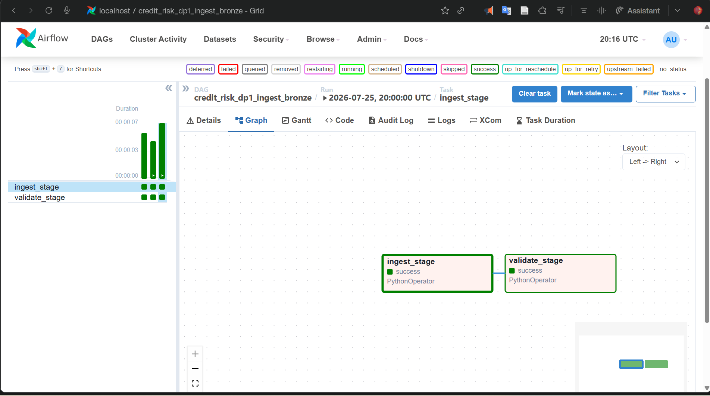
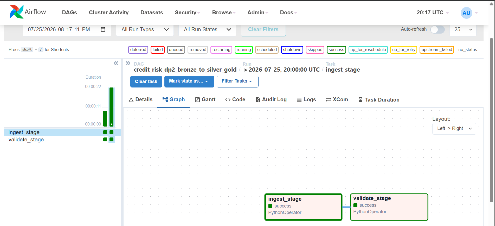
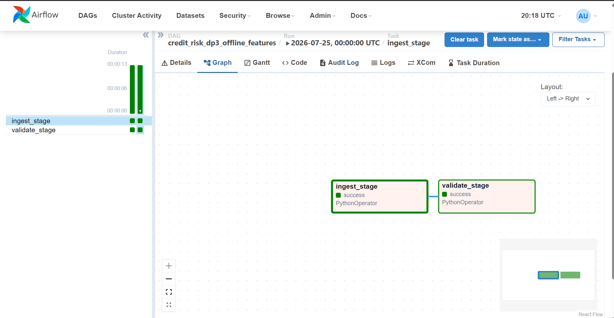

# Airflow Data Pipeline Orchestration Guide

## Overview
This document provides the complete orchestration design and operational guide for the Credit Risk Data Platform using Apache Airflow. It covers the pipeline architectures for DP1, DP2, and DP3, detailing the mandatory Ingest and Validate stages.

---

## Folder and File Structure

* `docker-compose.yml`: Root configuration file containing infrastructure services (Zookeeper, Kafka, Data Generator, Airflow).
* `dags/credit_risk_dp1_ingest_bronze.py`: Pipeline DP1 for raw data ingestion into the Bronze zone.
* `dags/credit_risk_dp2_bronze_to_silver_gold.py`: Pipeline DP2 for data transformation from Bronze to Silver and Gold zones.
* `dags/credit_risk_dp3_offline_features.py`: Pipeline DP3 for computing offline feature tables (e.g., `f_customer_total_orders_90d`).
* `docs/airflow_orchestration_guide.md`: Comprehensive documentation for orchestration and execution.

---

## Pipeline Stage Architecture

All pipelines enforce a strict sequential task execution order to separate data loading from quality verification:

```
[ Ingest Stage ] ---> [ Validate Stage ]
```

1. **Ingest Stage (`ingest_stage`):**
   * Responsible for extracting raw streaming events, processing transformations, or calculating feature matrices.
   * Defined as `task_id='ingest_stage'`.

2. **Validate Stage (`validate_stage`):**
   * Responsible for schema compliance assertions, null-value checks, and business rule validations.
   * Defined as `task_id='validate_stage'`.

---

## Pipeline Definitions

### 1. Pipeline DP1: Ingest Raw Data into Bronze Zone
* File Path: `dags/credit_risk_dp1_ingest_bronze.py`
* Description: Orchestrates ingestion from streaming sources into the Bronze zone.


### 2. Pipeline DP2: Bronze to Silver and Gold Zones
* File Path: `dags/credit_risk_dp2_bronze_to_silver_gold.py`
* Description: Handles transformations and data loading from Bronze into Silver and Gold layers.


### 3. Pipeline DP3: Offline Feature Computation
* File Path: `dags/credit_risk_dp3_offline_features.py`
* Description: Computes offline feature tables such as `f_customer_total_orders_90d`.

---

## Execution and Verification Instructions

1. Start the platform infrastructure and Airflow container using Docker Compose:
   ```bash
   docker compose up -d
   ```
2. Access the Airflow Web UI at `http://localhost:8080`.
3. Log in with credentials (`admin` / `admin`).
4. Enable and trigger the DAGs (`credit_risk_dp1_ingest_bronze`, `credit_risk_dp2_bronze_to_silver_gold`, `credit_risk_dp3_offline_features`).
5. Navigate to the **Graph View** of each pipeline to inspect the sequential execution order from `ingest_stage` to `validate_stage` for reporting and documentation purposes.